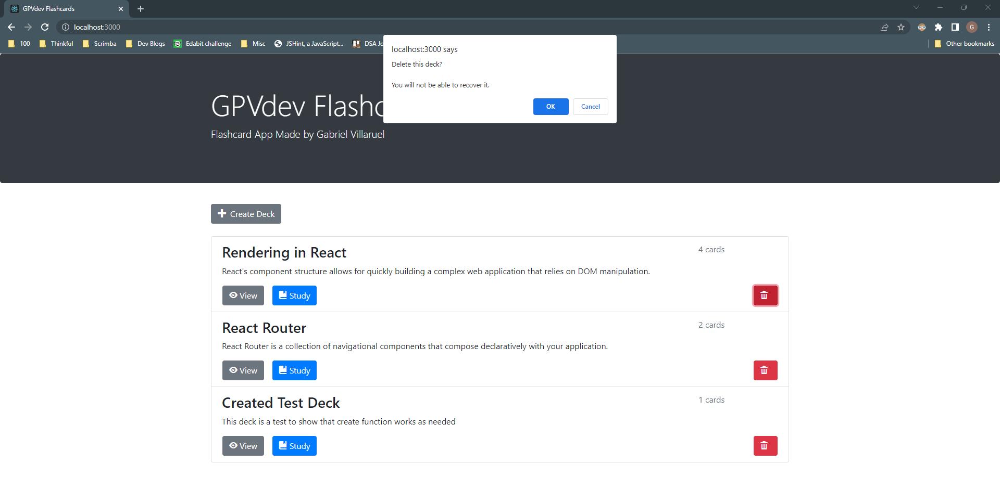
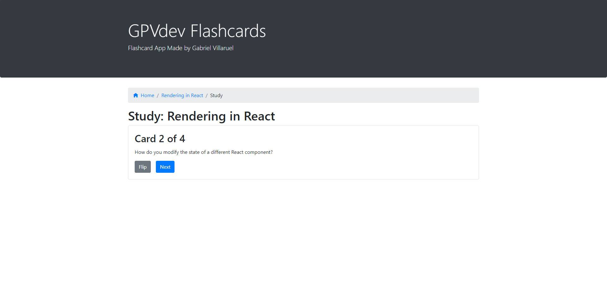
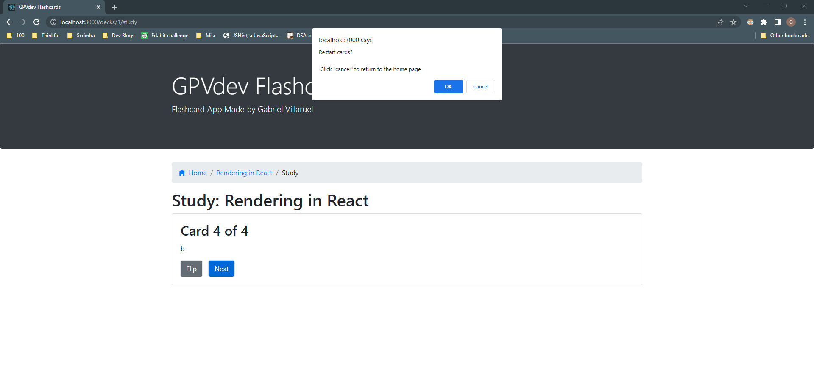
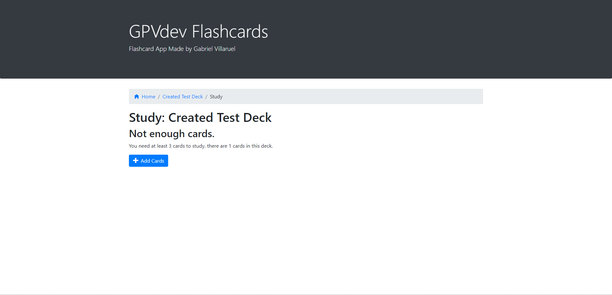
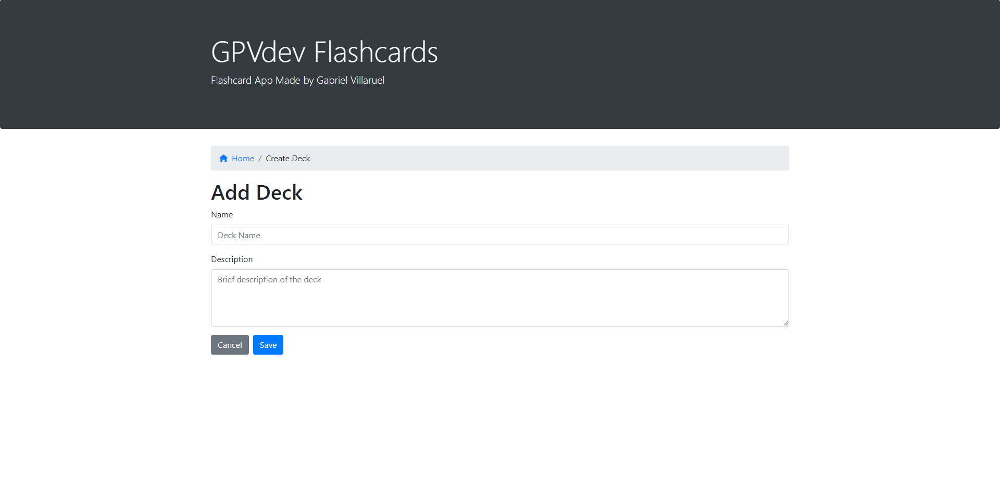
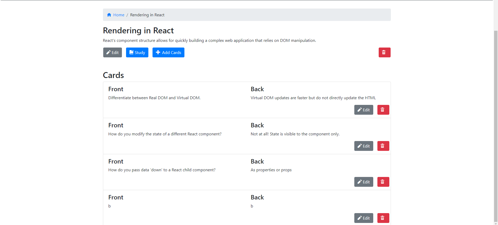

# GPVdev Flashcards
GPVdev Flashcards is a study tool application intended for learners who utilize flashcards for their studies. This can also apply to teachers and tutors who wish to create flashcards for their students in the subjects they 
teach.

## Technology
### Built with:
- JavaScript, React, HTML, CSS, Bootstrap.

## Installation
1. Fork and clone this repository.
2. Run `npm install` to install project dependencies.
3. Run `npm run start` to concurrently start the project's frontend and backend.

## Screenshots
### Home Page:

### Delete Deck Prompt:
When the user clicks on the `Delete` button associated with a particular deck, a warning message is shown. The user can either click
`OK` or `Cancel`. If the user clicks `OK`, the deck is deleted and will no longer be visible on the Home page.

### Study Screen:

### Restart Prompt:
Once the user reaches the back-side of the last card in the deck, a warning message will appear. The user is offered the opportunity
to restart the deck by clicking on the `OK` button. If the user chooses not to restart studying this deck, the `Cancel` button will take the
user back to the Home page.

### Not Enough Cards:
The study screen will display that there are not enough cards if the deck has less than three cards. An "Add
Cards" button will be present to satisfy the 3 card minimum and will take user to the Add Card page, `decks/:deckId/cards/new`.

### Create Deck:

### Deck Screen:
